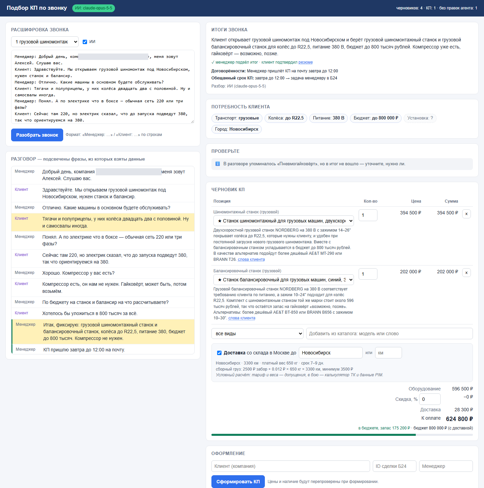
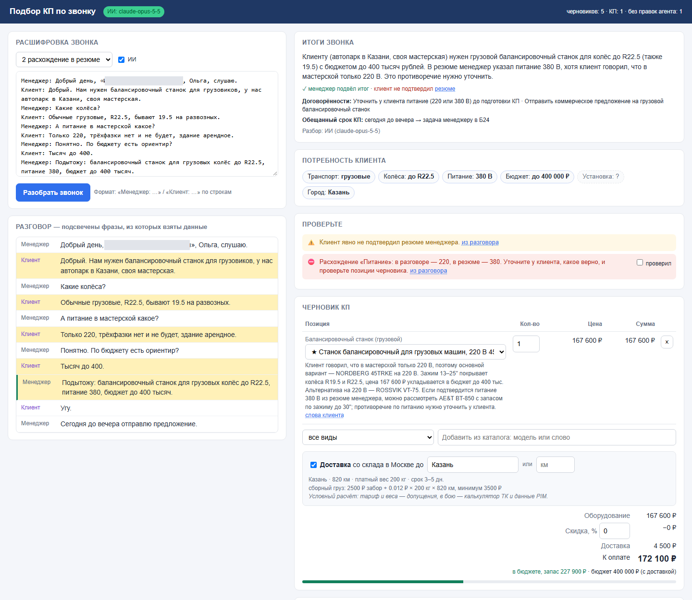
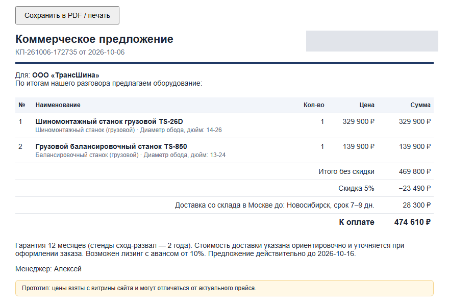

# КП по звонку — прототип

Внутренний веб-инструмент для менеджеров по продажам: вставляешь расшифровку звонка, получаешь черновик коммерческого предложения. Менеджер проверяет черновик, подтверждает спорные места и выпускает КП в PDF.

Сделан как тестовое задание на позицию «Специалист по автоматизации бизнес-процессов» (дистрибьютор оборудования для автосервисов). Название компании и контакты в публичной версии заменены, каталог урезан до демо-выборки.



## Зачем

После звонка менеджер вручную вспоминает, что нужно клиенту, ищет модели в каталоге, проверяет совместимость (диаметр колёс, питание 220/380 В), переносит цены, считает доставку и собирает документ. Шагов много, ошибок тоже.

## Как устроено

Это конвейер, а не «свободный агент»: ИИ делает то, что плохо формализуется (понять разговор и объяснить выбор), а цены, совместимость и лимиты проверяет код.

```
расшифровка звонка
  → ИИ: потребность клиента по JSON-схеме, у каждого значения дословная цитата
  → код: проверка, что цитаты действительно есть в разговоре
  → код: кандидаты из каталога по правилам (питание, зажим диска, сегмент)
  → ИИ: выбор основного варианта и альтернатив только из кандидатов
  → код: предупреждения (блокирующие / важные / к сведению), бюджет, доставка
  → менеджер проверяет черновик
  → КП (HTML → PDF), заглушка отправки в Битрикс24, журнал для метрик
```

Главный источник правды — итог, который менеджер проговаривает в конце звонка. Если итог расходится с разговором (клиент говорил «только 220», а в итоге «380»), черновик блокируется до подтверждения:



Если ключа API нет или ИИ ответил не по схеме, разбор идёт по правилам: инструмент работает и без LLM.

## Что внутри

| Шаг | Файл |
|---|---|
| Разбор реплик, извлечение потребности (ИИ или правила), проверка цитат | `app/extract.py` |
| Правила подбора и подсказки инженера, выбор ИИ из кандидатов | `app/matcher.py` |
| Предупреждения, сборка КП, лимит скидки, журнал и метрики | `app/pipeline.py` |
| Доставка: город из разговора → расстояние по справочнику → условный тариф | `app/delivery.py` |
| Тонкий адаптер к LLM (structured outputs, fallback) | `app/llm.py` |
| API и страница КП | `app/server.py`, `app/static/index.html` |
| Парсер каталога с витрины сайта и сборка Excel (для справки, адреса заменены) | `parse_catalog.py`, `build_table.py` |

Защиты на сервере: цены берутся только из каталога (вручную — только для позиций «по запросу»), скидка ограничена лимитом, доставка пересчитывается заново, метрика «КП без правок» считается сравнением итога с черновиком, а не по флагу из браузера.



## Цифры (замерено на прототипе)

- 2 запроса к Claude на звонок, ≈ $0,04–0,05 за звонок.
- Разбор занимает 11–23 секунды.

## Запуск

```
pip install -r requirements.txt
python run.py
```

Откройте http://127.0.0.1:8000 и выберите один из примеров звонков в `samples/`. Чтобы включить ИИ, скопируйте `.env.example` в `.env` и вставьте ключ Anthropic. Без ключа работает разбор по правилам.

Тесты (режим без ИИ):

```
pip install -r requirements-dev.txt
python -m pytest -q
```

## Допущения и ограничения

- Битрикс24 — заглушка: показывает, какие REST-вызовы ушли бы в сделку. Реальной интеграции нет.
- Расстояния и тариф доставки условные; в рабочей версии — калькулятор транспортной компании и веса из PIM.
- Лимит скидки 10% и срок действия КП 10 дней — допущения, которые нужно согласовать.
- Каталог — демо-выборка из 34 позиций с публичной витрины; цены могут не совпадать с актуальными.

## Как делалось

Задачу, процесс и проверки проектировал я, код писался вместе с Claude Code. По ходу находил и исправлял ошибки ИИ: карточки категорий, попавшие в каталог как товары; неверные правила («трёхфазки нет» → 380 В); бюджет клиента, утекавший в КП для клиента.

Стек: Python, FastAPI, Claude API (structured outputs), HTML/JS, openpyxl.
